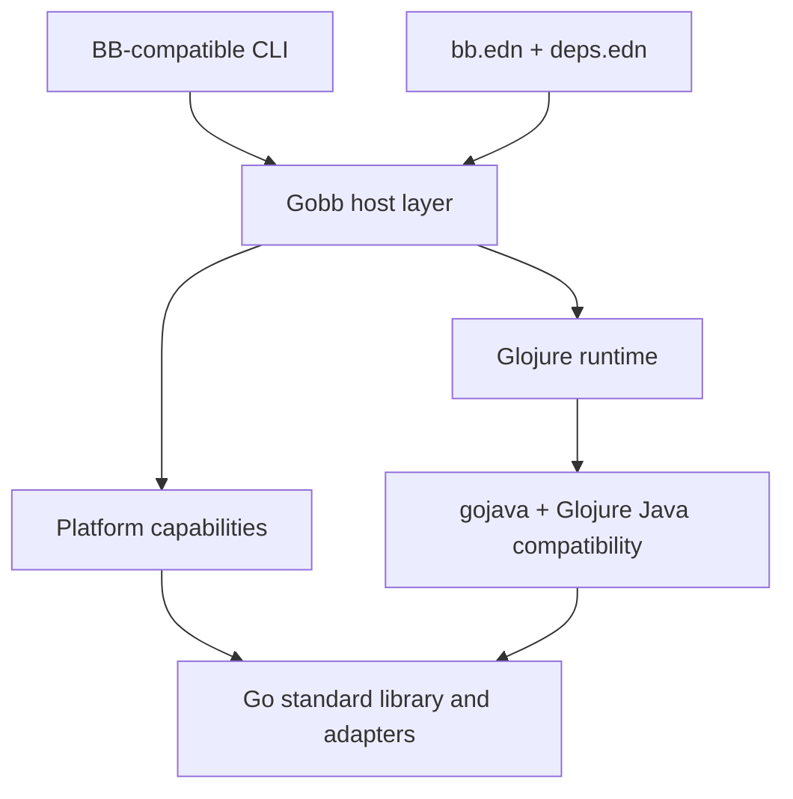

# Implementation details

Gobb is not a recompiled copy of Babashka. BB's host implementation is deeply
coupled to SCI, JVM classes, and GraalVM native-image configuration. Gobb keeps
the behavior users depend on while replacing that host architecture.

## Runtime architecture



### Glojure replaces SCI

Glojure owns the language runtime:

- reading and evaluating Clojure forms;
- namespaces and Vars;
- dynamic bindings;
- macros and runtime compilation;
- source loading and `require`;
- Clojure data types and semantics.

Gobb therefore does not recreate SCI's context, namespace-copy, allowlist, or
evaluation APIs. It maps BB behavior directly onto Glojure's native runtime.

### Gobb supplies the BB environment

The Gobb host layer is responsible for:

- CLI parsing and invocation modes;
- `*file*`, standard streams, arguments, environment, and working directory;
- preloads, resources, data readers, and load paths;
- `bb.edn`, tasks, aliases, and exec functions;
- dependency resolution;
- pods, REPLs, servers, and process behavior;
- platform capability checks;
- `gobb build`.

## Runtime and build modes

The two modes share one project basis and one Glojure runtime.

=== "Run"

    ```console
    $ gobb -e '(println (+ 20 22))'
    42

    $ gobb script.clj argument
    ```

    Source is read and evaluated at runtime, preserving the interactive and
    dynamic behavior expected from BB.

### Runtime source loading

Gobb initializes Glojure's native source loader with the current working
directory. Additional source roots use BB's `-cp` or `--classpath` option and
the host platform's path-list separator:

```console
$ gobb --classpath src -e \
    "(require '[example.math :as math]) (math/answer)"
42
```

The configured value is also exposed through the `java.class.path` system
property. Namespace names follow Clojure resource conventions, including
hyphen-to-underscore conversion. Project paths from `bb.edn` and `deps.edn`,
aliases, local roots, Git checkouts, and source-bearing Maven artifacts use
the same loader. See [Projects and dependencies](projects.md).

=== "Build"

    ```console
    $ gobb build script.clj -o app --platform linux/amd64
    $ ./app argument
    ```

    Gobb resolves the same source, dependencies, and resources, then asks Gloat
    to generate a self-contained Go build. Runtime evaluation remains available
    inside the resulting program unless a future explicit optimization mode
    disables it.

    Gobb stages the resolved project source graph and delegates compilation to
    Gloat. Gobb finds `gloat` on `PATH`, or uses the executable named by
    `GOBB_GLOAT`. Native targets use `--platform OS/ARCH`; `js/wasm` selects
    Gloat's browser-Wasm output.

    `make smoke` proves the path by evaluating one namespace with Gobb, then
    building and executing it as a native program, WASI under Wasmtime, and
    browser Go/Wasm under the JavaScript runtime. All four outputs must match.

## Java compatibility without a JVM

Many useful Clojure libraries refer to Java classes even when their core logic
is portable. Gobb handles this incrementally:

1. Use a native Glojure type where one already matches.
2. Use or extend a JVM-faithful gojava implementation.
3. Register a Glojure host-class bridge.
4. Adapt an appropriate Go standard-library or third-party package.
5. Report a precise unsupported dependency when no implementation exists.

Compatibility is driven by BB's exposed class surface, upstream tests, and
real library failures. Reusable support belongs in gojava or Glojure rather
than a Gobb-only workaround.

## Platform capabilities

One generated capability contract covers interpreted and compiled programs.
It is compiled and executed independently under native Go, WASI, and browser
Wasm. See the complete, tested [platform capability matrix](platforms.md).

Unavailable operations use structured exception data:

```clojure
{:type :gobb/unsupported-capability
 :capability :process
 :target :browser
 :platform "js/wasm"
 :operation :spawn
 :status :unavailable}
```

## Project configuration

Gobb preserves `bb.edn` and `deps.edn` wherever their behavior can be matched.
Project configuration supplies paths, aliases, and local, Git, or Maven
dependencies:

```clojure
{:paths ["src"]
 :deps  {example/tool {:git/url "https://example.invalid/tool"
                       :git/sha "abc123"}
          local/tool {:local/root "../tool"}
          medley/medley {:mvn/version "1.4.0"}}
 :aliases
 {:dev {:extra-paths ["dev"]
        :extra-deps {example/test-support
                     {:local/root "../test-support"}}}}}
```

Resolution is implemented by Gobb and does not invoke Clojure or a JVM.

## Tasks and native processes

The `babashka.tasks` compatibility namespace evaluates task forms in a stable
Glojure namespace. Gobb validates dependency graphs, interns dependency
results under their task names, applies initialization, requirements, and
hooks, and uses Glojure futures for parallel dependency levels.

The task `shell` helper maps process options onto Go's `os/exec`: streams,
environment, working directory, exit status, and captured pipeline output
never pass through Java process classes. The platform capability layer rejects
process creation predictably under WASI and browser-Wasm. See
[Tasks and processes](tasks.md).

## Bundled libraries

Milestone 9 ports BB's bundled libraries in dependency-shaped waves. The first
wave is a Gobb-owned `babashka.fs` adapter backed directly by Go's filesystem
packages and Glojure's `Path` and `File` compatibility types. Gobb pins the
upstream `babashka.fs` source revision as the behavioral reference without
adding it as a Gobb Git submodule.

The current slice covers core path construction and inspection, predicates,
directory and file creation, recursive visitors and glob matching, byte and
line I/O, copy, move, delete, links, temporary files and scopes, executable
lookup, XDG paths, POSIX permissions, and zip, gzip, and extraction.
Differential fixtures run the same operations under pinned BB and Gobb. JVM
`FileTime`-style attributes remain open and are recorded as partial in the
generated inventory.

Gobb evaluates source one top-level form at a time. This is important for BB
compatibility: an earlier `require`, `ns`, or `defmacro` must affect analysis
of the forms that follow it. It also lets bundled macros such as
`babashka.fs/with-temp-dir` work in ordinary scripts.

The next library wave exposes `babashka.process` over the same Go
`os/exec` substrate used by tasks. Its current differential contract covers
tokenization, asynchronous future-backed results, process builders, captured
pipelines, string and byte capture, file redirection, environment changes,
working directories, lifecycle callbacks, `sh`, `shell`, and the `$` macro.
Direct JVM-style stream records, true process destruction, and replace-image
`exec` remain partial.

The first networking wave exposes the pinned `babashka.curl` API through the
same native process adapter. It covers the common request methods, headers,
query and form parameters, string and file bodies, byte responses, redirects,
debug commands, and BB-compatible response and error maps. The differential
suite uses both file URLs and a repository-local HTTP server, so it does not
depend on a public test service. Live response streams are currently buffered;
WASI has no socket substrate, and the browser target still needs a Fetch-based
adapter.

The same transport now backs the pinned core `babashka.http-client` surface:
client defaults, all common methods, headers, query and form parameters,
bodies, redirects, buffered async requests, and function clients are checked
against BB using the local server. JVM-specific client constructors, complete
interceptor customization, WebSocket support, and browser Fetch remain open.

The bundled-library substrate also includes a Go-backed `clojure.java.io`
surface. Files, relative paths, parent creation, byte streams, readers,
writers, copying, classpath resources, and deletion are differentially checked
against BB. True `java.net.URL` objects, character-set conversion, and the
complete JVM protocol-extension surface remain partial.

The first data-library slice pins `clojure.data.csv` 1.0.0 and provides its
public `read-csv` and `write-csv` API over Go's `encoding/csv`. Differential
fixtures cover strings and readers, custom separators, standard CSV quoting,
and LF and CRLF output. Alternate quote characters, custom quote predicates,
and lazy incremental reads remain partial.

Core JSON support pins Cheshire 6.2.0 and maps its string, stream, sequence,
key-conversion, array-coercion, and generation APIs onto Go's `encoding/json`.
Factories, custom encoders, Smile, and strict duplicate-key detection remain
open and are kept partial in the inventory.

## Repository boundaries

Gobb selectively ports BB behavior rather than maintaining a wholesale fork.
Work is divided by ownership:

| Project | Responsibility |
|---|---|
| Gobb | BB compatibility, CLI, tasks, dependencies, packaging |
| Glojure | Clojure runtime, compiler, namespaces, evaluation |
| gojava | JVM-faithful behavior implemented in Go |
| Gloat | source-to-Go compilation and cross-compilation |
| Makes | reproducible local automation and tool provisioning |

This keeps generally useful fixes upstream and prevents Gobb from accumulating
private runtime forks.
