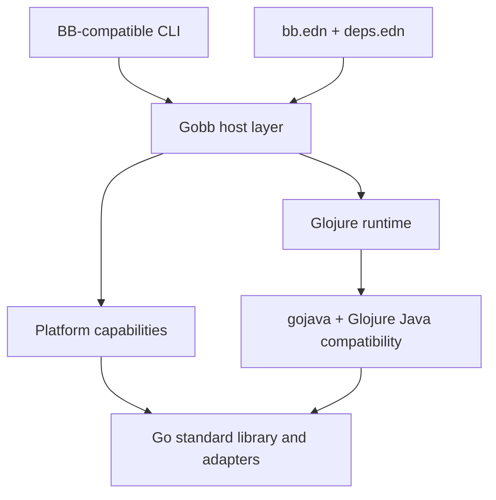

# Implementation details

Gobb is not a recompiled copy of Babashka. BB's host implementation is deeply
coupled to SCI, JVM classes, and GraalVM native-image configuration. Gobb keeps
the behavior users depend on while replacing that host architecture.

## Runtime architecture



### Glojure replaces SCI

Glojure owns the language runtime:

- reading and evaluating Clojure forms;
- namespaces and Vars;
- dynamic bindings;
- macros and runtime compilation;
- source loading and `require`;
- Clojure data types and semantics.

Gobb therefore does not recreate SCI's context, namespace-copy, allowlist, or
evaluation APIs. It maps BB behavior directly onto Glojure's native runtime.

### Gobb supplies the BB environment

The Gobb host layer is responsible for:

- CLI parsing and invocation modes;
- `*file*`, standard streams, arguments, environment, and working directory;
- preloads, resources, data readers, and load paths;
- `bb.edn`, tasks, aliases, and exec functions;
- dependency resolution;
- pods, REPLs, servers, and process behavior;
- platform capability checks;
- `gobb build`.

## Runtime and build modes

The two modes share one project basis and one Glojure runtime.

=== "Run"

    ```console
    $ gobb -e '(println (+ 20 22))'
    42

    $ gobb script.clj argument
    ```

    Source is read and evaluated at runtime, preserving the interactive and
    dynamic behavior expected from BB.

### Runtime source loading

Gobb initializes Glojure's native source loader with the current working
directory. Additional source roots use BB's `-cp` or `--classpath` option and
the host platform's path-list separator:

```console
$ gobb --classpath src -e \
    "(require '[example.math :as math]) (math/answer)"
42
```

The configured value is also exposed through the `java.class.path` system
property. Namespace names follow Clojure resource conventions, including
hyphen-to-underscore conversion. This phase covers filesystem source; project
paths from `bb.edn` and dependency classpaths arrive with project
configuration and dependency resolution.

=== "Build"

    ```console
    $ gobb build script.clj -o app --platform linux/amd64
    $ ./app argument
    ```

    Gobb resolves the same source, dependencies, and resources, then asks Gloat
    to generate a self-contained Go build. Runtime evaluation remains available
    inside the resulting program unless a future explicit optimization mode
    disables it.

    The initial build spike accepts a dependency-free Clojure namespace with
    `-main` and delegates compilation to Gloat. Gobb finds `gloat` on `PATH`,
    or uses the executable named by `GOBB_GLOAT`. Native targets use
    `--platform OS/ARCH`; `js/wasm` selects Gloat's browser-Wasm output.

    `make smoke` proves the path by evaluating one namespace with Gobb, then
    building and executing it as a native program, WASI under Wasmtime, and
    browser Go/Wasm under the JavaScript runtime. All four outputs must match.

## Java compatibility without a JVM

Many useful Clojure libraries refer to Java classes even when their core logic
is portable. Gobb handles this incrementally:

1. Use a native Glojure type where one already matches.
2. Use or extend a JVM-faithful gojava implementation.
3. Register a Glojure host-class bridge.
4. Adapt an appropriate Go standard-library or third-party package.
5. Report a precise unsupported dependency when no implementation exists.

Compatibility is driven by BB's exposed class surface, upstream tests, and
real library failures. Reusable support belongs in gojava or Glojure rather
than a Gobb-only workaround.

## Platform capabilities

One generated capability contract covers interpreted and compiled programs.
It is compiled and executed independently under native Go, WASI, and browser
Wasm. See the complete, tested [platform capability matrix](platforms.md).

Unavailable operations use structured exception data:

```clojure
{:type :gobb/unsupported-capability
 :capability :process
 :target :browser
 :platform "js/wasm"
 :operation :spawn
 :status :unavailable}
```

## Project configuration

Gobb preserves `bb.edn` and `deps.edn` wherever their behavior can be matched.
Gobb-specific build and host configuration uses namespaced keys:

```clojure
{:paths ["src"]
 :deps  {example/tool {:git/url "https://example.invalid/tool"
                       :git/sha "abc123"}}

 :gobb/build
 {:platforms ["linux/amd64" "darwin/arm64" "wasip1/wasm"]}

 :gobb/go-deps
 {example.com/adapter "v1.2.3"}

 :gobb/capabilities
 #{:filesystem :http-client}}
```

## Repository boundaries

Gobb selectively ports BB behavior rather than maintaining a wholesale fork.
Work is divided by ownership:

| Project | Responsibility |
|---|---|
| Gobb | BB compatibility, CLI, tasks, dependencies, packaging |
| Glojure | Clojure runtime, compiler, namespaces, evaluation |
| gojava | JVM-faithful behavior implemented in Go |
| Gloat | source-to-Go compilation and cross-compilation |
| Makes | reproducible local automation and tool provisioning |

This keeps generally useful fixes upstream and prevents Gobb from accumulating
private runtime forks.
