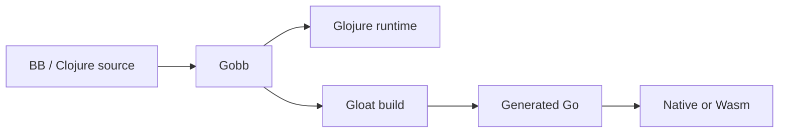

<section class="hero">
  <div class="hero-content">
    <h1>Go + bb!</h1>
    <p class="hero-copy">
      Gobb is the
      <a href="https://github.com/babashka/babashka">Babashka</a> source code
      compiled by <a href="https://gloathub.org/">Gloat</a> using the Go hosted
      <a href="https://github.com/glojurelang/glojure">Glojure</a> runtime;
      without SCI, GraalVM, or a JVM.
    </p>
    <div class="hero-actions">
      <a class="button button-primary" href="implementation/">See how it works</a>
      <a class="button button-secondary" href="roadmap/">Follow the build</a>
    </div>
  </div>
  <figure class="hero-visual">
    
    <figcaption><em>It's not a trick, it's an illusion.</em></figcaption>
  </figure>
</section>

<div class="status-strip">
  <span class="status-pulse"></span>
  <strong>Current phase:</strong> Foundation and architecture
  <span class="status-note">Implementation has just begun.</span>
</div>

## Install

!!! tip "No language toolchain required"

    The only prerequisites are `git`, `make`, `curl`, and a Bash binary.
    You do not need Go, Babashka, Glojure, Gloat, Python, or MkDocs
    pre-installed—Gobb's Makefile provisions its toolchain automatically.

Clone Gobb and install it:

```bash
git clone https://github.com/clojurestar/gobb
make -C gobb install
```

The default prefix is `$HOME/.local`, or `/usr/local` when running as root.
To choose another installation prefix:

```bash
make -C gobb install PREFIX=/some/path
```

## One runtime, two ways to ship

Gobb is designed to preserve the fast, practical scripting workflows that make
BB useful while adding native compilation as a first-class operation.

<div class="feature-grid">
  <article class="feature-card">
    <span class="feature-number">01</span>
    <h3>Run Clojure directly</h3>
    <p>
      Evaluate expressions, scripts, stdin, namespaces, tasks, and project
      dependencies through the full Glojure runtime.
    </p>
    <pre><code>gobb script.clj one two three</code></pre>
  </article>

  <article class="feature-card">
    <span class="feature-number">02</span>
    <h3>Build native programs</h3>
    <p>
      Turn the same program into a native executable or WebAssembly artifact
      through Gloat and the Go toolchain.
    </p>
    <pre><code>gobb build script.clj -o app</code></pre>
  </article>

  <article class="feature-card">
    <span class="feature-number">03</span>
    <h3>Meet Java code in Go</h3>
    <p>
      Grow compatibility with Java-dependent Clojure libraries through
      reusable gojava shims and Go-backed host adapters.
    </p>
    <pre><code>(Math/sqrt 144) ; => 12.0</code></pre>
  </article>
</div>

## The intended pipeline



Glojure provides reading, evaluation, namespaces, Vars, dynamic bindings, and
Clojure semantics. Gobb adds BB-compatible command behavior, tasks,
dependencies, bundled features, platform policy, and packaging.

## Compatibility is measured, not implied

The project will track BB behavior feature by feature and test Gobb against a
pinned BB executable. Platform differences are explicit: when a host cannot
provide an operation, Gobb returns a stable capability error instead of a
missing symbol or an obscure host failure.

<div class="callout">
  <div>
    <p class="callout-label">Project status</p>
    <h2>The architecture and roadmap are defined.</h2>
    <p>
      Runtime execution, compatibility work, and cross-platform artifacts are
      the next engineering milestones.
    </p>
  </div>
  <a class="text-link" href="roadmap/">View current progress →</a>
</div>
